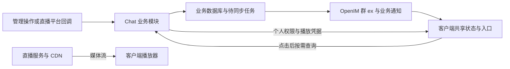

# 群直播与功能入口：后端对接说明

> 2026-10-05 更新：用户已提供现有后端群直播合同，直播客户端接入记录见 [群直播客户端接入](group-live-client-integration.md)。下文的游戏接口和后端架构仍属于设计建议；现有部署只支持定向用户业务通知，直播公共摘要通过 OpenIM 群资料事件同步，不能按建议假设支持群业务广播。

核对日期：2026-10-05。依据当前 `openim-flutter-demo` 前端源码整理，参考 99chat 提交 `d7c3c65`。

本文区分“当前客户端已调用的契约”和“建议后端新增的实现”。当前工作区没有现有 Chat 后端源码，未确认下列业务接口已在服务器部署。本轮只整理文档，不修改后端或发布服务。

## 1. 后端需要完成什么

建议在现有 Chat API／RPC 中增加群功能和直播业务模块，继续使用现有登录、群关系、资金与任务能力。可以在内部代理现有游戏或直播业务服务，客户端仍访问当前 `Config.appAuthUrl`；无需给客户端新增另一套账号或令牌。

| 部分 | 后端职责 | 客户端用途 |
| --- | --- | --- |
| 群公共摘要 | 维护 `GroupInfo.ex.groupFeatures`，同步真实直播状态、游戏启用与入口开关 | 会话角标、直播横条、游戏与开奖记录入口 |
| 个人权限 | 合并返回当前用户在该群的直播、运营、代理、历史权限与确认绑定 | 显示私人入口、首次配置、推流及打赏 |
| 实际业务 | 直播授权／播放／推流／结束；游戏运营、开奖、代理数据与结算 | 点击入口后执行功能 |
| 同步与通知 | 版本、完整摘要、可靠落库、OpenIM 镜像、权限变化通知 | 已打开页面及时更新，断线后恢复 |

**只修改 `ex` 可以让公开入口出现，不能让直播、游戏或代理业务自动可用。** 实际视频流由直播服务／CDN 提供，OpenIM 传递群资料和通知。



## 2. 群公共字段：一份摘要控制所有公开入口

下例是 `GroupInfo.ex` 字符串解码后的对象。写入 OpenIM 时必须序列化成字符串，并保留根对象中原有其他字段。

管理后台「群组 → 资料 → 群游戏」另外维护顶层数字 `gameType`：0 普通群、1 三公游戏、2六合彩代理、3六合彩开奖、4 三公代理。例如 `{"gameType":1}` 不需要同时存在 `groupFeatures`。客户端只读该类型，三公运营浮窗另外要求类型为 1；类型为 3 时直接显示开奖把手和工具箱入口，缺少机器码在页面内提示，其他群保留既有显式开奖开关。缺失、非法 JSON、非对象、非数字及未知值按普通群。后台先通过 `POST /group/get_groups_info` 读最新资料，再合并其他扩展字段，通过 `POST /group/set_group_info` 写 `groupInfoForSet.ex`；非 JSON 对象的历史资料应先整理。类型不授予个人业务权限或改写业务摘要版本。

```json
{
  "groupFeatures": {
    "schemaVersion": 1,
    "revision": 12,
    "live": {
      "status": "ready",
      "sessionID": "live_001",
      "roomName": "群直播间",
      "description": "欢迎观看",
      "anchorUserID": "user_anchor",
      "scheduledStartAt": null
    },
    "games": {
      "sangong": {
        "enabled": true,
        "manageEntry": true,
        "agentEntry": true,
        "rebateHistoryEntry": true
      },
      "markSix": {
        "enabled": true,
        "agentEntry": true,
        "drawHistoryEntry": true,
        "rebateHistoryEntry": true,
        "machineCode": "machine_001",
        "gameID": "game_001"
      }
    }
  }
}
```

- `schemaVersion` 当前为整数 `1`；`revision` 必须为非负整数，同一群内有实际摘要变化时递增。
- 所有开关使用 JSON boolean，不使用 `0/1` 或字符串 `"true"`。缺失开关按关闭处理。
- `enabled=true` 应表示后端已经确认业务绑定有效且允许启用；解绑、停用时同时更新摘要。
- 三公、六合彩的业务开关独立维护；顶层 `ex.gameType` 只表示后台设置的群类型，不代替启停、绑定或个人业务权限。
- 开奖实例公开定位使用真实 `machineCode`。如果 `gameID` 与机器码不是同一语义，不依赖客户端 fallback。
- 三公租户从个人权限或确认绑定接口返回；不需要在公共 `ex` 放租户权限。
- 不把个人代理身份、余额、token、推流密钥、签名播放地址放入公共摘要。

### 直播状态

| 公共 `live.status` | 对应业务场次状态 | 当前显示 |
| --- | --- | --- |
| `none` | 没有活动场次 | 不显示直播角标／观看横条 |
| `scheduled` | `SCHEDULED` | “待开播”，进入预约／等待观看 |
| `ready` | `AUTHORIZED` | “有直播”，进入等待观看 |
| `live` | `LIVE` | “直播中”，点击后确认场次并取播放地址 |
| `ended` | `ENDED` 或 `BANNED` | 隐藏观看入口；旧观看页停止播放，旧推流页清密钥 |

活动状态必须有非空 `sessionID`。结束摘要保留场次 ID 和新 `revision`；新一场直播使用新的 ID。不要仅因创建成功或预约时间到达就写成 `live`。

## 3. 每个入口的实际显示条件

以下默认用户已登录且仍是当前群成员。群主／管理员身份只用于部分导航展示，不能替代后台业务授权。

| 入口 | 当前前端判断 | 后端应该提供什么 |
| --- | --- | --- |
| 群列表／会话直播角标 | `live.status` 为 `scheduled/ready/live` | 最新完整直播摘要；活动状态必须有场次 ID |
| 群内直播横条 | 上述活动状态 + 非空 `sessionID` | 标题、描述、主播 OpenIM 用户 ID、预约时间 |
| 工具箱“群直播” | SDK 群管理员，或 `canConfigure/canManage/canPush` 任一成立 | 当前用户的直播能力；每次操作再鉴权 |
| 三公运营／代理菜单及浮窗 | 当前完整用户资料 `isPrivileged === true`；运营浮窗另需顶层数字 `ex.gameType=1` 并尊重保存的隐藏设置；三公代理工具箱及浮窗另需 `ex.gameType=4` | 类型为 1 的运营入口不要求旧群摘要、绑定或业务能力；点击后仍校验实际业务权限 |
| 三公首次配置页面 | 账号特权之外要求 `sangong.canConfigure` | 点击运营入口后读取当前权限；未启用／未绑定时，获准配置者可进入 |
| 三公运营业务、状态条与 SSE | 账号特权 + `enabled && manageEntry && canManage` + 有效私人权限 + 已确认租户 | 私有 `tenantID` 可省一次绑定查询；失败时入口页展示原因与重试 |
| 三公代理业务页面 | 账号特权 + `enabled && agentEntry && canOpenAgent` + 确认租户 | 当前用户在该群的代理能力及绑定；不据特权字段补造权限 |
| 三公帮工管理 | 独立 `canManageMembers` 或确认配置中的角色能力 | 不能只因有配置权限便授予帮工管理 |
| 三公私人历史 | 代理权限之外再要求 `rebateHistoryEntry && canViewRebateHistory` | 逐日数据／划转历史的独立能力 |
| 右侧开奖记录把手 | `markSix.enabled && drawHistoryEntry` + 非空开奖实例 | 在公共摘要返回正确 `machineCode` |
| 工具箱“开奖记录” | `enabled && drawHistoryEntry` | 当前菜单不检查机器码，后端必须保证启用时绑定完整 |
| 六合彩票代理 | `enabled && agentEntry && canOpenAgent` | 仅授权当前用户；私人浮窗还检查权限快照有效 |
| 六合彩反水历史 | `enabled && rebateHistoryEntry && canViewRebateHistory` | 独立历史权限，不等同于开奖记录权限 |

公开开奖是“当前群成员可看”，不是匿名接口。普通成员不应为了看到游戏状态而被授予 `canManage`；当前三公运营状态条是运营入口的一部分。六合彩 `canConfigure/canManage` 可被模型解析，但当前没有相应配置／管理页面，绑定先由后端管理端完成。

## 4. 合并个人权限接口

当前客户端已调用：

```text
GET /chat/groups/{URL编码后的groupID}/feature-capabilities
token: 当前 chatToken
operationID: 每次请求新生成的 UUID
```

操作者由 Chat 登录态取得，不信任客户端传入另一个用户 ID。后端确认实时群成员、业务角色和绑定后，一次返回各模块能力。以下是有部分业务权限的用户示例，不能作为所有群成员的默认权限：

```json
{
  "errCode": 0,
  "errMsg": "",
  "data": {
    "groupID": "group_001",
    "capabilityVersion": 5,
    "cacheTTLSeconds": 300,
    "live": {
      "canConfigure": true,
      "canManage": true,
      "canPush": false,
      "canTip": true,
      "tipCurrencies": [
        {"code": "USDT", "label": "USDT", "decimals": 6}
      ]
    },
    "sangong": {
      "canConfigure": true,
      "canManage": true,
      "canOpenAgent": false,
      "canManageMembers": true,
      "canViewRebateHistory": false,
      "tenantID": "tenant_001"
    },
    "markSix": {
      "canConfigure": false,
      "canManage": false,
      "canOpenAgent": true,
      "canViewRebateHistory": true,
      "machineCode": "machine_001",
      "gameID": "game_001"
    }
  }
}
```

`data.groupID` 必须与请求群完全相同，否则前端拒绝整份响应。`capabilityVersion` 按“用户＋群”的能力上下文递增，不与群 `revision` 比较。客户端 TTL 限制为 0～300 秒；同群并发请求合并，失败负缓存 30 秒。

建议权限来源：配置和运营按业务授权＋实时群角色核验；推流只授予当前指定主播或明确授权的推流者；代理和历史分别查询对应业务身份。后端不因“是某个游戏的代理”自动授予所有游戏代理权限。

三公 capability 字段为 **`tenantID`**；参考 `my-config/entry-context` 的字段为 **`tenantId`**。普通三公业务会附 `X-Tenant-Id`，后端仍需确认用户有权操作该租户。六合彩 `/me/...` 请求仅通过 `X-Group-Id` 定位群，后端用“当前用户＋群”查真实绑定，不套用三公租户 header。

## 5. 直播接口：按当前客户端路径实现

所有直播路径挂在当前 Chat 业务地址下，前缀固定为 `/group-live/api/v1`。请求头使用当前 Chat `token`、`operationID`；成功建议统一 `errCode=0`，`data` 放实际 DTO。

| 方法 | 前缀后的路径 | 请求／成功 data | 业务授权 |
| --- | --- | --- | --- |
| GET | `/groups/{groupID}/live/current` | `{active:false}` 或 `{active:true,session:场次DTO}`；可同时返回完整 `groupFeatures` | 当前群成员 |
| POST | `/groups/{groupID}/live/authorize` | `roomName,anchorUserId,description?,scheduledStartAt?` → 场次 DTO | `canConfigure`，且主播为允许的群成员 |
| PATCH | `/groups/{groupID}/live/schedule` | `roomName,scheduledStartAt` → 场次 DTO | `canManage`；当前请求不修改主播／描述 |
| POST | `/groups/{groupID}/live/stop` | 无业务请求体 → 已结束场次 DTO | `canManage` |
| POST | `/groups/{groupID}/live/revoke` | 无业务请求体 → 已关闭／结束场次 DTO | `canManage` |
| GET | `/live/{sessionID}` | 场次 DTO，包含历史终态；可同时返回完整群摘要 | 当前群成员，核对场次属于该群 |
| GET | `/live/{sessionID}/play-info` | 有效播放 DTO | 成员、场次当前允许观看 |
| GET | `/live/{sessionID}/push-info` | 私人推流 DTO | `canPush` + 当前场次主播／推流授权 |
| POST | `/live/{sessionID}/tip` | 打赏请求 → `tipId,liveSessionId` | `canTip` + 实时场次／资金鉴权 |

除 `current` 外，场次 DTO **直接位于 data 内**，不再包一层 `session`。创建、预约、结束响应建议在同一个 data 中附上完整 `groupFeatures`，让操作端立即更新入口。

### 场次 DTO 与命名差异

```json
{
  "liveSessionId": "live_001",
  "groupId": "group_001",
  "status": "AUTHORIZED",
  "roomName": "群直播间",
  "description": "欢迎观看",
  "anchorUserId": "user_anchor",
  "version": 3,
  "scheduledStartAt": null,
  "expireAt": "2026-10-06T00:00:00Z",
  "endReason": ""
}
```

| 含义 | 公共群摘要 | 直播接口 DTO |
| --- | --- | --- |
| 场次 ID | `sessionID` | `liveSessionId` |
| 主播 ID | `anchorUserID` | `anchorUserId` |
| 群 ID | 群资料本身的 `groupID` | `groupId` |
| 状态 | 小写 `ready/live/...` | 大写 `AUTHORIZED/LIVE/...` |
| 预约时间 | Unix 毫秒或 ISO 字符串 | UTC ISO-8601 字符串或 null |

业务 DTO 状态为 `SCHEDULED/AUTHORIZED/LIVE/ENDED/BANNED`。同一场次的 `version` 单调递增；终态不可被旧开播回调复活。名称最多 10 字、描述最多 30 字，预约至少在服务端当前时间一分钟后。场次时效 `expireAt` 与凭据时效 `expiresAt` 是两个字段。

### 播放与推流 DTO

```json
{
  "liveSessionId": "live_001",
  "roomName": "群直播间",
  "anchorUserId": "user_anchor",
  "protocol": "hls",
  "playUrl": "https://media.example.test/live_001/index.m3u8?sign=example",
  "fallbackHlsUrl": "",
  "fallbackFlvUrl": "",
  "expiresAt": "2026-10-05T14:00:00Z"
}
```

```json
{
  "rtmpServer": "rtmp://push.example.test/live",
  "streamKey": "live_001?sign=example",
  "obsHint": "请将推流地址和密钥分别填入 OBS。",
  "expiresAt": "2026-10-05T14:00:00Z"
}
```

以上地址仅示意 DTO，不是真实服务。播放器拉流不附加 Chat token，所以后端应给可直接使用的签名 HTTP／HTTPS 地址。当前沿用 `video_player`，建议提供 HLS；RTC／TRTC／LEB 需要真实可播放的 HTTP 备用地址。后端负责播放、推流授权到期与结束撤销，不能仅依赖前端隐藏地址。

观看凭据已按服务端 `expiresAt` 提前续签，内嵌和全屏共享一次调度；失败按退避重试，到期即停止使用旧地址。后台、退出、结束和换场会取消请求及调度，恢复前台后合并校准。推流地址到期后禁用复制／二维码，由手动刷新续取。

## 6. 一场直播的后端处理流程

1. **创建／授权**：鉴权、核对主播群成员和参数；按群锁定或事务保证最多一个活动场次。立即创建为 `AUTHORIZED`，预约创建为 `SCHEDULED`，保存场次及新摘要。
2. **到预约时间**：服务端任务转为 `AUTHORIZED`，发布 `ready` 摘要，等待真实推流；不按时间直接发布 `LIVE`。
3. **获取推流信息**：向获准主播签发短期推流凭据，流标识绑定场次 ID；授权后给新主播发送个人能力变更通知。
4. **真实开播回调**：直播平台通知推流已建立；后端验签、去重，核对流标识和当前场次。有效事件将场次转为 `LIVE`，递增场次版本和群摘要版本。
5. **断流／结束／撤销**：管理操作或可信平台事件使场次进入终态，并停止／撤销流授权。断流宽限期由服务端配置，宽限期间不因单次瞬断新建场次。
6. **结束后再开播**：生成新场次 ID；迟到的旧开播、结束或平台回调只能作用于旧场次，不能关闭或恢复新场次。
7. **每次事务**：同时落库真实状态、完整群摘要、待同步记录；提交后回复实际 DTO，后台重试 OpenIM 镜像与通知。

当前后端腾讯直播回调路由为 `/group-live/api/v1/callbacks/tencent`，由直播平台调用，客户端不调用。后端校验供应商签名、去重并核对当前场次；仅真实开播回调将状态变为 `LIVE`。

当前 authorize/schedule/stop 请求**没有**稳定 `clientRequestID/expectedRevision`。每次新 `operationID` 只是追踪标识。首版必须有一个群一个活动场次、终态不可回退、重复 stop/revoke 返回已有终态等约束；创建结果未确认时通过 current 查询确认。若要严格区分跨场次重复创建或并发修改，后续需同时给前后端增加稳定请求 ID／期望场次版本，不能只让后端等待客户端尚未发送的字段。

## 7. 摘要怎么同步到 OpenIM

业务数据库是权威来源，OpenIM `ex` 是用于客户端显示的镜像。建议事务内记录待同步任务，后台按群串行处理：读取最新完整摘要 → 合并现有 ex 根对象 → 序列化 → 更新群资料。旧任务不要携带旧整串 ex 覆盖最新状态。

官方当前接口为 `POST {OpenIM_API}/group/set_group_info_ex`，请求体使用 `groupID` 和字符串 `ex`，请求头为服务端管理员 `token`、`operationID`；以响应 `errCode=0` 确认成功。管理员凭据保留在可信后端，部署版本的路由和权限需联调核对。[OpenIM 群资料更新接口](https://docs.openim.io/zh/platform-api/group/managing-groups/set-group-info-ex)

业务提交与 OpenIM 同步分别记录。业务已成功但镜像暂时失败时，返回已提交的 DTO／完整摘要，可以附 `imSyncStatus:"pending"`；由后台继续重试，不让用户重复创建或重复扣款。

所有写 ex 的业务必须共用合并／串行入口，保留其他命名空间和未知字段；当前群摘要中的 revision 不会让 OpenIM 自动执行 CAS。不要让前端任意提交 `live.status`、个人权限或摘要版本。旧 ex 不是 JSON 时先制定迁移规则，不能直接清空。

建议后台管理配置增加 `PATCH /chat/groups/{groupID}/features`，采用稳定请求 ID、期望群 revision、字段白名单和按模块权限；该通用配置接口**当前客户端尚未调用**。直播使用第 5 节实际路由，三公首次绑定使用第 9 节真实配置接口。

## 8. 通知格式与权限撤销

优先通过群资料变化同步公共入口。需要立即更新已打开的业务页面时，复用当前自定义业务通知，不把入口变化作为普通聊天消息。

客户端接受的公共事件示例：

```json
{
  "key": "groupFeaturesChanged",
  "data": {
    "eventId": "event_001",
    "groupID": "group_001",
    "groupFeatures": {
      "schemaVersion": 1,
      "revision": 13,
      "live": {
        "status": "ended",
        "sessionID": "live_001",
        "roomName": "群直播间",
        "anchorUserID": "user_anchor"
      },
      "games": {
        "sangong": {"enabled": false},
        "markSix": {"enabled": false}
      }
    }
  }
}
```

此例表示两个游戏也已关闭。实际事件必须携带数据库中的**完整最新摘要**，不能在只结束直播时把仍开启的 games 省略或写成空对象。当前也接受 `groupLiveChanged/groupGameChanged`，但统一使用完整摘要便于按群 revision 去重。

个人权限变化定向发送给受影响用户：

```json
{
  "key": "groupFeatureCapabilitiesChanged",
  "data": {
    "eventId": "permission_event_001",
    "groupID": "group_001",
    "capabilityVersion": 6
  }
}
```

官方业务通知接口是 `POST {OpenIM_API}/msg/send_business_notification`：群事件指定 `recvGroupID`，个人事件指定 `recvUserID`，`data` 为上述 data 对象的 JSON 字符串；指定 `sendUserID` 和 `sendMsg:false`。投递等级可按部署支持选择；低频撤权、结束等关键事件可采用可靠通知，不能把每秒游戏状态都写成必达通知。[OpenIM 业务通知接口](https://docs.openim.io/zh/platform-api/message/sending-messages/send-business-notification)

客户端会丢弃旧摘要／旧权限版本，权限变化使旧上下文失效并合并重查。直播接口遇到 HTTP 403 或 `1002/20012` 时会使共享权限缓存失效；通用请求层不替其他模块自动执行此行为。后端撤权仍应发送上述定向事件，并在业务接口实时拒绝旧权限。消息到达并不代替鉴权，离线恢复仍由群资料和业务快照校准。

## 9. 游戏入口对应的后端绑定

### 三公

- 当前账号的展示门槛为聊天服务10008的 `POST /user/find/full` 中匹配自身userID的严格布尔 `isPrivileged:true`；登录响应不作为来源。客户端登录后、前台恢复、进入群聊／群功能面板和进入三公页面前刷新，缺失／失败隐藏入口，关闭后退出特权路由。运营／代理菜单和浮窗的展示不再依赖旧群摘要与业务能力；点击入口后先刷新群业务权限，失败时保留原因与重试页。群业务权限和租户校验继续独立保留。该字段由管理员通过10009的 `POST /user/privilege/set` 单独管理，客户端不调用此管理接口，也不在注册或导入中开启。受限业务操作仍须服务端读取最新字段和实际权限校验。
- 私有权限中返回确认 `tenantID`，客户端可直接复用；否则会按需查询 my-config 或 entry-context。业务接口不能直接相信租户 header。
- `GET /sangong/api/v1/admin/my-config`，未配置明确返回 `configured:false`；不要以 404／空对象代表“可以首次配置”。
- `PUT /sangong/api/v1/admin/my-config` 保存 `name,imGroupGameId,imGroupAdminStatsId,imGroupLedgerId,imBotUserId`，可带 `imGroupWaterId`；成功确认 `configured:true`、`tenantId`、匹配当前群的 `imGroupGameId`，返回真实 `myRole`（owner/admin）、`canEditConfig/canManageMembers`，并附完整群摘要。
- `GET /sangong/api/v1/agent/entry-context?imGroupId=...` 按当前用户＋群确认 `showAgentEntry`、`tenantId` 与 `agentImGroupId`；该查询及 my-config 不使用租户 header。
- 运营浮窗共享 `/sangong/api/v1/admin/events/snapshot` 和 `/sangong/api/v1/admin/events/stream` SSE。完整状态须有正整数 `version`、真实 `settings.doorCount`（2～10）；状态版本按业务租户维护，不与群 revision 混用，服务重启不能回到旧版本。
- 截止、结算、上下分、报表与代理路径见 [三公接口说明](../lib/pages/group_features/sangong/README.md)。OpenIM 群／用户 ID 当作不透明字符串，不套腾讯群后缀或把消息 clientMsgID 强转数字。
- 公开账号输入由现有联系人搜索解析为真实 OpenIM userID。全部用户精确查找使用已有 `user-detail?imUserId=...` 和已确认租户；服务端必须校验该用户在当前租户中的可见性，找不到返回 `USER_NOT_FOUND`，不能退回其他租户资料。
- 已提供合同的 `user-flow` 仅支持 `imUserId/userId/sessionId`，按账变编号倒序返回最近最多500条；`user-hierarchy` 支持自然日 `date` 汇总。完整较早日流水仍需服务端扩展：先按自然日或场次过滤，再分页，并返回可校验的续页信息和真实覆盖范围。此为待确认扩展，当前客户端没有发送新日期／分页参数。
- 可负额度写入确认须包含匹配的三公数字 userId 与实际 maxNegative。旧版void确认时客户端只额外读取一次同租户user-detail核实；未知结果不重复写入。返水申请有效amount仅表示申请被确认，前端不据此宣称到账；后端应在实际入账完成后提供可追溯结果。
- 2026-10-06默认Chat地址 `http://129.226.192.93:10008` 的my-config和events/snapshot两条 `/sangong` GET路径只读核验返回404；实际三公服务地址、代理前缀及源码尚待确认，未执行资金或结算线上写入。

### 六合彩

- 群公开摘要给真实 `machineCode`，开奖只需群成员权限；当前解析绑定优先级为 capability.machineCode → ex.machineCode → capability.gameID → ex.gameID。
- 开奖读取 `/api/v1/lotteries/mark-six-demo/{config,draws,predictions}`，携带 `machineCode` 和 `X-Group-Id`。`mark-six-demo` 是参考路由名，不代表客户端会生成演示数据。
- 私人 `/me/agent/...` 用当前 Chat 用户＋`X-Group-Id` 校验代理与业务绑定，不依赖客户端机器码或三公租户。
- 开奖响应保留 `groupUid/serverTime/data`；预测返回与查询一致的 `page/window/hasMore`。统计在客户端计算已有开奖数据，不需要另建统计轮询接口。
- 级差申请初始化会查询 `/me/agent/rebate/apply/status`：无申请明确返回 `NONE`；处理中返回 `PENDING/PROCESSING`，成功返回 `SUCCESS`。POST 返回 `NONE` 或未知结果不会被当成成功；后端仍须核验待结算金额和重复申请。
- 代理历史、下级、个人历史、导出等路径见 [六合彩接口说明](../lib/pages/group_features/mark_six/README.md)。当前没有六合彩配置 UI，也没有迁移“眯牌”手势。

## 10. 打赏与写请求结果

打赏币种必须由 `capabilities.live.tipCurrencies` 返回真实币种码、名称和精度。`99/BI99/PLATFORM` 不自动互换。请求为 `currency,amount,payPin,clientOrderId,memo?`；金额是最小单位正整数，最大 `9007199254740991`；支付密码六位，备注最多 50 字。

`amount=1000000`、币种精度 6 表示 1 个币种单位。打赏成功 data 至少为正数 `tipId` 与匹配的 `liveSessionId`，只能在真实扣款／记账完成后返回。复用现有资金业务，在事务中完成授权、余额校验、扣款、入账和订单结果保存。

以“用户＋clientOrderId”执行幂等：同参数重试返回原结果，参数冲突拒绝；不能按每次变化的 operationID 再扣一次。客户端超时会保留原订单，重开页面继续重试原参数。明确业务失败应表示本次确实未提交；已经提交却结果未确认时，不返回一个会被前端误认作最终拒绝的假失败。

所有业务使用实际 `errCode/data`，有错误给准确 `errMsg`。404／501 表示未开通；权限不足使用 403 及业务错误；失效 token 沿用现有 Chat／OpenIM 错误码。HTTP 200、空 DTO 或只返回“操作成功”不能替代必要业务结果。资金、密钥和完整签名地址不写入普通请求日志。

## 11. 推荐的最小数据与任务

保留当前数据库与部署方式，不要求为入口另建微服务。

| 数据归属 | 最小内容 |
| --- | --- |
| 群功能记录 | groupID、各模块配置／绑定、当前直播 ID、完整摘要、revision、更新时间 |
| 用户群能力 | 真实业务角色／代理关系、用户与群的 capabilityVersion；可由现有角色关系派生 |
| 直播场次 | sessionID、groupID、主播、名称／描述、状态、预约时间、version、内部流标识、终态原因 |
| 平台回调去重 | 供应商事件 ID、场次／流 ID、处理结果；防重复和乱序 |
| 同步任务 | 群／事件 ID、目标 revision、镜像／通知处理状态、重试时间与次数 |
| 打赏订单 | 用户、clientOrderId、原参数摘要、实际交易与返回结果；复用现有账本 |

首版可以在现有服务中执行可靠任务 worker，事务保存待同步记录即可；只有现有部署已有消息队列或吞吐需要时再复用队列。关键是落库、失败可重试、按群合并最新状态，而不是为显示入口增加新一层网络服务。

## 12. 请求数量与实施顺序

已有有效群资料时，公开入口没有单独业务查询；首次入群页面最多增加一条合并个人权限查询，重复进入复用缓存。直播的活动资格、场次 ID 或主播变化时会失效并合并刷新已有权限；同场 `ready` 转 `live` 等显示状态变化不单独补权限查询。游戏绑定、启用或私人入口变化也会失效并补一条合并权限请求。

直播只在实际观看时取场次详情和播放凭据；三公按前台订阅共享一条 SSE；六合彩按打开页面／标签懒加载。不让每个会话行或入口分别查一次“有没有直播／是不是代理”。后台预约、回调、同步任务与前端轮询是不同职责。

建议落地顺序：

1. 群功能数据／真实绑定、合并权限接口，先验证不同用户看到正确入口。
2. 完整摘要、revision、OpenIM ex 合并同步和定向权限通知，先验证启用、关闭、解绑与恢复。
3. 直播 current／授权／预约／结束／详情、真实直播平台回调、播放与推流凭据。
4. 三公首次绑定及租户鉴权、快照和 SSE；六合彩公开开奖、代理和历史。
5. 最后联调打赏、资金结算和导出，验证幂等与结果未确认后的恢复。

## 13. 联调验收与现有前端边界

- 普通成员、配置者、运营、三公代理、六合彩代理、指定主播分别核对入口与业务权限；公开开奖不依赖代理权限。
- scheduled／ready／live／ended 的角标、横条及等待／结束页面正确；旧回调／旧查询不能影响新场次。
- 仅主播获推流密钥；播放凭据在客户端可直接使用；过期、结束、撤销后服务端实际禁止旧授权。
- 同群两游戏共存；结束直播时不清掉游戏配置；所有 ex 写入保留其他业务字段。
- 同步失败可重试，旧任务不会覆盖新摘要；权限撤销同时拒绝操作并定向通知旧页面。
- 当前直播创建／预约／结束尚无稳定写入幂等键；创建结果未确认时只查询 current 校准，不自动重复提交。打赏使用稳定 `clientOrderId`。观看自动续签已接入，仍需真实直播源验证长时间拉流与凭据轮换。
- 三公首次绑定响应带完整摘要时，会触发共享权限 epoch 更新；保存页面对已提交结果的确认与忙态结束需要真实共享仓库集成回归。不要通过省略摘要或扩大权限绕过该边界。
- 当前六合彩没有配置／运营 UI、“眯牌”手势；后端不要把这些入口当成已接入的客户端能力。

源码核对入口：

- [群模型](../lib/pages/group_features/models/group_features.dart)、[个人能力模型](../lib/pages/group_features/models/group_feature_capabilities.dart)、[工具箱条件](../lib/pages/group_features/widgets/group_feature_actions.dart)。
- [共享仓库与事件](../lib/pages/group_features/data/group_feature_store.dart)、[Chat 请求层](../lib/pages/group_features/data/group_feature_api.dart)。
- [直播实际路由](../lib/pages/group_features/live/data/live_api.dart)、[直播 DTO](../lib/pages/group_features/live/models/live_models.dart)。
- [三公模块](../lib/pages/group_features/sangong/README.md)、[六合彩模块](../lib/pages/group_features/mark_six/README.md)、[原始扩展设计](group-feature-extension-design.md)。

当前 OpenIM 前端与本地参考目录没有对应的可用 GitNexus 索引，本次入口条件以当前本地源码直接核对。其他历史 99chat 索引未作为当前实现依据。
